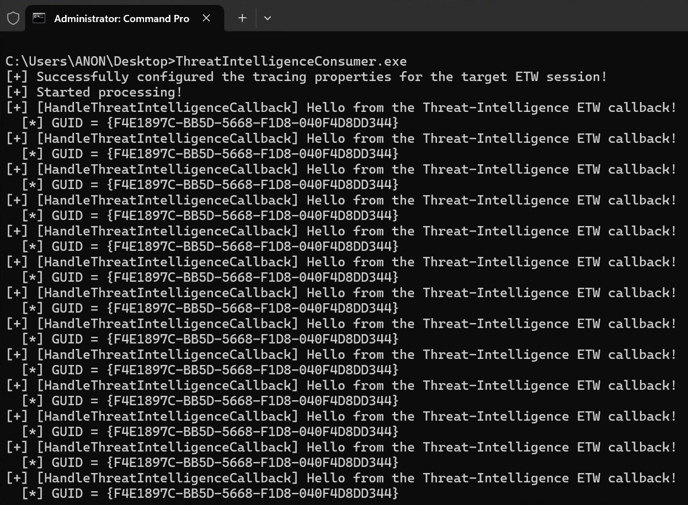

# ThreatIntelligenceConsumer

For the focused Sense.Client / DefenderCore1DS / Sense.GeneratedETW capture, use the [three-provider test profile and NDJSON build instructions](profiles/README.md). The instructions below describe the original single-provider proof of concept.

Proof-of-concept (POC) to consume from the Microsoft-Windows-Threat-Intelligence ETW provider without needing Protected Process Light (PPL) permissions/signing or a driver that does kernel-mode patching. It has been formally tested against Windows 11 24H2 and Windows 11 25H2 (alongside the latest Canary Insider Preview build, as of the time of this POC being uploaded).

## Output


### Overview
`ThreatIntelligenceConsumer` takes advantage of logic surrounding how [AutoLogger](https://learn.microsoft.com/en-us/windows/win32/etw/configuring-and-starting-an-autologger-session) ETW sessions which consume from privileged ETW providers are "protected" from being consumed by lower-privileged processes.

Please see the [associated blog](https://www.originhq.com/blog/securitytrace-etw-ppl) for technical details.

### Requirements
1. Administrative privilege
2. Writing to the AutoLogger Registry key
3. Running `ThreatIntelligenceConsumer.exe`
4. x64. No other architecture is supported due to function hooking and custom assembly.

### Instructions
1. First, install the `threat_intel_auto_logger.reg` Registry key.
2. Reboot your machine. This is so your AutoLogger session will be registered and running when the machine boots
3. Compile and run the `ThreatIntelligenceConsumer` project and associated output executable.

### Caveats
- The `ThreatIntelligenceConsumer` project makes a best effort to determine the logger ID (`TraceProperties->Wnode.HistoricalContext`). This should work in 99.9% of cases since retrieving this value is very deterministic. However, if the logger ID is wrong the project will emit errors or, additionally, no ETW events will arrive. In this case, the logger ID can be extracted from a kernel debugger (see the blog for reasons why you cannot query an AutoLogger ETW session which is emitting Threat-Intelligence ETW events without PPL):

```js
lkd> dx ((nt!_WMI_LOGGER_CONTEXT*(*)[0x50])(((nt!_ESERVERSILO_GLOBALS*)&nt!PspHostSiloGlobals)->EtwSiloState->EtwpLoggerContext))->Where(l => l != 1)->Select(i => i->LoggerName)
((nt!_WMI_LOGGER_CONTEXT*(*)[0x50])(((nt!_ESERVERSILO_GLOBALS*)&nt!PspHostSiloGlobals)->EtwSiloState->EtwpLoggerContext))->Where(l => l != 1)->Select(i => i->LoggerName)                
    [2]              : "Circular Kernel Context Logger" [Type: _UNICODE_STRING]
    [3]              : "Eventlog-Security" [Type: _UNICODE_STRING]
    [4]              : "CimFSUnionFS-Filter" [Type: _UNICODE_STRING]
    [5]              : "SdmaTracingEvents" [Type: _UNICODE_STRING]
    [6]              : "DefenderApiLogger" [Type: _UNICODE_STRING]
    [7]              : "DefenderAuditLogger" [Type: _UNICODE_STRING]
    [8]              : "DiagLog" [Type: _UNICODE_STRING]
    [9]              : "Diagtrack-Listener" [Type: _UNICODE_STRING]
    [10]             : "EventLog-Application" [Type: _UNICODE_STRING]
    [11]             : "EventLog-Intel-SST-DVD-DVD_ETW_Telemetry" [Type: _UNICODE_STRING]
    [12]             : "MpWppUpdateLogging" [Type: _UNICODE_STRING]
    [13]             : "EventLog-Microsoft-Windows-Hotpatch-Monitor-Analytic" [Type: _UNICODE_STRING]
    [14]             : "EventLog-System" [Type: _UNICODE_STRING]
    [15]             : "FilterMgr-Logger" [Type: _UNICODE_STRING]
    [16]             : "iclsClient" [Type: _UNICODE_STRING]
    [17]             : "iclsProxy" [Type: _UNICODE_STRING]
    [18]             : "Intel-Gfx-Driver" [Type: _UNICODE_STRING]
    [19]             : "LwtNetLog" [Type: _UNICODE_STRING]
    [20]             : "Microsoft-Windows-Rdp-Graphics-RdpIdd-Trace" [Type: _UNICODE_STRING]
    [21]             : "8696EAC4-1288-4288-A4EE-49EE431B0AD9" [Type: _UNICODE_STRING]
    [22]             : "NetCore" [Type: _UNICODE_STRING]
    [23]             : "NtfsLog" [Type: _UNICODE_STRING]
    [24]             : "PlatformLicenseManagerService" [Type: _UNICODE_STRING]
    [25]             : "RadioMgr" [Type: _UNICODE_STRING]
    [26]             : "MpWppTracing-20260103-050646-00000003-fffffffeffffffff" [Type: _UNICODE_STRING]
    [27]             : "ReFSLog" [Type: _UNICODE_STRING]
    [28]             : "WPR_initiated_DiagTrackAotLogger_WPR System Collector" [Type: _UNICODE_STRING]
    [29]             : "WinDiag-Realtime-Session" [Type: _UNICODE_STRING]
    [30]             : "UBPM" [Type: _UNICODE_STRING]
    [31]             : "WdiContextLog" [Type: _UNICODE_STRING]
    [32]             : "WiFiDriverIHVSession" [Type: _UNICODE_STRING]
    [33]             : "WiFiSession" [Type: _UNICODE_STRING]
    [35]             : "umstartup" [Type: _UNICODE_STRING]
    [36]             : "SCM" [Type: _UNICODE_STRING]
    [37]             : "SleepStudyTraceSession" [Type: _UNICODE_STRING]
    [38]             : "COM" [Type: _UNICODE_STRING]
    [39]             : "Terminal-Services-LSM" [Type: _UNICODE_STRING]
    [40]             : "Terminal-Services-RCM" [Type: _UNICODE_STRING]
    [41]             : "UpdateSessionOrchestration" [Type: _UNICODE_STRING]
    [42]             : "UserMgr" [Type: _UNICODE_STRING]
    [43]             : "CldFltLog" [Type: _UNICODE_STRING]
    [44]             : "WFP-IPsec Diagnostics" [Type: _UNICODE_STRING]
    [45]             : "ScreenOnPowerStudyTraceSession" [Type: _UNICODE_STRING]
    [46]             : "Admin_PS_Provider" [Type: _UNICODE_STRING]
    [49]             : "SMLS_Trace_Listener" [Type: _UNICODE_STRING]
    [50]             : "MoUxCoreWorker" [Type: _UNICODE_STRING]
    [51]             : "MpWppCoreTracing-20260102-230646-00000003-100000000" [Type: _UNICODE_STRING]
    [52]             : "1DSListener" [Type: _UNICODE_STRING]
    [53]             : "SHS-01022026-231728-7-1ff" [Type: _UNICODE_STRING]
    [54]             : "WPR_initiated_DiagTrackMiniLogger_WPR System Collector" [Type: _UNICODE_STRING]
    [55]             : "WINNETESP" [Type: _UNICODE_STRING]
```

The associated index is the ID. for instance, `DiagLog` (seen above) is logger ID `8`.

- The project simply just prints the GUID of the provider of which the ETW event was emitted (the Threat-Intelligence GUID). Event parsing is up to the user to implement. See details of how to parse manifest-based ETW providers via [TDH](https://learn.microsoft.com/en-us/windows/win32/etw/retrieving-event-data-using-tdh).

- The keyword mask for the provider is hardcoded to enable all Threat-Intelligence ETW events.